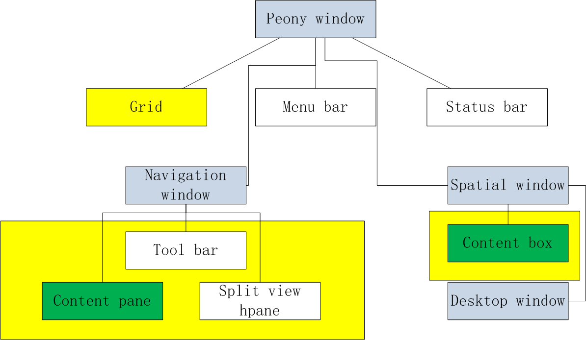

# 文件管理器简析

在阅读本章时，我建议大家同时git clone ukui/peony或者mate-caja项目然后打开vscode，我不可能把所有的关键代码都粘贴出来，如果有模糊的地方大家需要在源码中寻找线索，vscode的跳转和搜索功能简单易用，在没有相关的文档时，比较适合我们快速的定位关键点。

由于我是基于peony的代码进行分析的，一些代码可能比较过时，也可能有一些架构上的小改动令人纠结，大家可以对比caja对这些地方进行更加深刻的了解。

不过peony本质上是caja的fork是不会变的，它们的架构几乎一致，大多是ui上的改动，我们可以从架构层面入手，加深对整个文件管理器的理解。

我绘制了一些结构图来帮助我说明peony/caja的整个文件架构，我们首先关注文件管理器窗口的架构

我们看到的蓝灰色矩形内的内容是构成文件管理器窗口的类，白色是类的基本成员。从上图中我们可以看出文件管理器窗口的继承关系，在peony中，我们的窗口仅分为普通窗口和桌面窗口，普通窗口直接继承PeonyWindow，在窗口顶部拥有一个menubar，一个statusbar和一个grid，这个grid是管理整个窗口布局的控件，我们的peony window总是把menubar置于grid的顶部，而status bar则被置于grid的底部。而子类的区别其实就在于对grid内的控件结构，下面我们详细分析一下。

